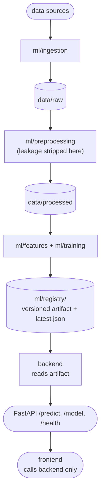

# Architecture & roadmap

## How the pieces fit

Training and serving are decoupled on purpose. The backend depends only on the
serialized artifact and `joblib`, never on training code, so you can retrain
without redeploying the API and deploy the API without shipping the training
stack.

## Build order

1. **Spike the data.** Pull a few thousand cases, label them, confirm you can
   extract genuinely pre-decision features. If the data is not there, stop —
   nothing downstream matters.
2. **Train the baseline.** `python -m training.train_baseline`. This is your
   honest performance floor and your leakage detector (a near-perfect baseline
   means a leak, not a breakthrough).
3. **Serve it.** The `/predict` route already wraps the artifact.
4. **Use it.** The frontend form posts a case and shows probability +
   uncertainty.
5. **Then improve the model** — LEGAL-BERT or Longformer for long documents,
   richer metadata, calibration — and add bias auditing to evaluation.

## Where to extend

| You want to... | Touch |
|----------------|-------|
| Add a data source | `ml/ingestion/` |
| Change the prediction target | labeling in `ml/preprocessing/`, `LABEL_COLUMN` in training |
| Swap in a transformer | `ml/training/`, then the artifact contract in `ml/inference/` and `backend/.../inference_service.py` |
| Store cases / users / audit logs | `backend/app/db/` (add SQLAlchemy + Alembic) |
| Audit for bias | `ml/evaluation/metrics.py:group_metrics` |

## Responsible-use notes

- Surface uncertainty everywhere; never present a bare verdict.
- Report group-wise metrics, not just aggregate accuracy.
- Some jurisdictions restrict profiling individual judges — check before
  building judge-specific features.
- Keep a model card in `ml/registry/` describing data, intended use, and known
  limitations of each shipped model.
