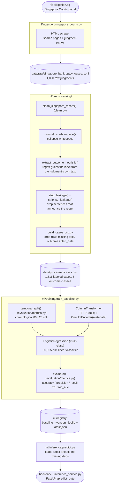

# Model details

This is the living reference for exactly how the current model is built:
what data feeds it, every transformation between raw scrape and trained
artifact, the architecture, and known weaknesses. `ARCHITECTURE.md` gives the
system-level picture; `DATA.md` gives general data-sourcing guidance. This
file is the one that should always match the *actual current pipeline code* —
update it (or ask Claude to) whenever `ml/ingestion/`, `ml/preprocessing/`,
`ml/features/`, or `ml/training/train_baseline.py` change in a way that
affects what the model sees or how it's trained. Add a dated entry to the
[Changelog](#changelog) at the bottom for every such change, however small.

Numbers in this doc reflect the latest retrain as of **2026-09-14**
(version `20260914_154554`, following the Phase 1.1 targeted re-scrape —
see the Changelog). Re-run `python -m training.train_baseline` and update
this doc if you retrain.

A test suite exists at `ml/tests/` (`cd ml && python -m pytest tests/`) —
run it after any change to `ml/preprocessing/`, `ml/evaluation/`, or
`ml/training/train_baseline.py`, before rebuilding `cases.csv` or
retraining. See [Testing](#12-testing) at the bottom. A tabulated,
run-by-run comparison of every retrain's metrics lives in
`docs/MODEL_RESULTS.md` — use that, not just this file, to see which
changes actually moved the numbers.

---

## 1. Pipeline overview



Nothing here has been swapped for a transformer or wired into `ml/features/
build_features.py` yet (see [§8](#8-whats-built-but-not-wired-in) — that
module exists but `train_baseline.py` doesn't call it).

---

## 2. Data source

**Source:** [elitigation.sg](https://www.elitigation.sg) — Singapore Courts'
public judgments portal. No API, no login, no token. Full judgment text is
published free. Scraped via `ml/ingestion/singapore_courts.py`.

CourtListener (`ml/ingestion/courtlistener.py`) was the original target but
has **zero Singapore coverage** — verified directly against its `/courts/`
endpoint, which only returns US federal/state/tribal/territory/military
courts plus three UK courts under "International."

**Query used (original pull):** `"bankruptcy" OR "insolvency"` (free-text,
not the portal's `CatchWords:"..."` subject-tag filter), `Filter=SUPCT`
(Supreme Court — Court of Appeal + General Division of the High Court; no
other court filter value was found to work), `max_results=1000`.

**Targeted re-scrape (2026-09-14, `docs/MODEL_IMPROVEMENTS.md` Phase 1.1):**
added `data/raw/singapore_bankruptcy_cases.jsonl` in three rounds, each a
grid of `{topic} AND {disposition term}` flat queries (the portal's WAF
returns 403 on parenthesized/grouped queries like `(a OR b) AND c` — only
flat two-term `AND` queries work), aimed specifically at growing the rare
disposition classes rather than pulling more of the same distribution:
- Round 1-2: topics `bankruptcy`/`insolvency` × disposition terms `"struck
  out"`/`"strike out"`/`"withdrawn"`/`"allowed in part"`/`"partially
  allowed"` → 198 + 89 new cases.
- Round 3: broadened topics to insolvency-adjacent Singapore proceedings —
  `winding up`, `liquidation`, `scheme of arrangement` (not topic drift;
  these are core insolvency-practice categories) — × the same disposition
  terms → 1,644 more.
- Total raw pool: 1,000 → 2,931 judgments, 0 fetch failures across 1,931
  new records.

**Known imprecision:** this is a broad keyword match, not a topical filter.
Spot-checking search results showed cases that only mention "bankruptcy" or
"insolvency" in passing (e.g. a document-privilege dispute, a trusts case, a
lawyer disciplinary matter) alongside genuine insolvency cases. A tighter
`CatchWords:"Insolvency Law"` query returns ~425 Supreme Court hits under
the original pull's scope — still not tried as an alternative/complement to
the targeted re-scrape above. **Whether the Round 3 topic broadening adds
legitimate signal or dilutes topical coherence is not yet isolated** — see
`docs/MODEL_RESULTS.md` Run 12 for the open diagnostic (compare accuracy on
the original-topic subset vs. the newly-added-topic subset).

**Raw output:** `data/raw/singapore_bankruptcy_cases.jsonl`, 2,931 lines,
one JSON object per judgment:

| field | source | notes |
|---|---|---|
| `case_id` | parsed from result URL, e.g. `2026_SGHC_156` | |
| `case_name` | search result card | |
| `citation` | search result card, e.g. `[2026] SGHC 156` | used to derive `court` later |
| `decision_date` | search result card `data-searchparam` | **decision** date, not filing date — see §4 |
| `case_number` | search result card, e.g. `HC/OA 711/2025` | not currently used downstream |
| `catchwords` | search result card, the portal's own subject tags | not currently used downstream |
| `judgment_url` | constructed | not currently used downstream |
| `text` | full judgment page, `#divJudgement` | the entire judgment — **outcome is written inside it** (see §4) |
| `coram` | full judgment page, `.HN-Coram` | not currently used downstream |

Scrape etiquette: 1 request/second (`_SLEEP_SECONDS` in the ingestion
module), honest `User-Agent` string (no browser spoofing — confirmed the
portal doesn't require it), no `robots.txt` found restricting access at time
of writing.

---

## 3. Labeling: how `outcome` is derived

There is no structured "did they win" field anywhere in the source. The
label is **inferred from the judgment's own concluding language** by
`extract_outcome_heuristic()` in `ml/preprocessing/clean.py`. As of
2026-08-22 this is a **5-class heuristic**, replacing an earlier binary
version (allowed/dismissed only) — see the [Changelog](#changelog) for why.

1. Take the last 6,000 characters of `text` (`window` parameter, widened
   from 3,000 on 2026-09-14 — see the Changelog) — Singapore judgments
   announce their disposition near the end, typically under a "Conclusion"
   heading, before the counsel/solicitor listing.
2. Run five separate regexes over that window, one per category:
   - **`withdrawn`** — `withdrawn`, or `allow(ed) [the ...] to withdraw`,
     or `permitted to withdraw`.
   - **`allowed_part`** — `allow(ed)/grant(ed) in part`, or
     `partial(ly) allow(ed)/grant(ed)`.
   - **`struck_out`** — `struck out` / `strike out`.
   - **`dismissed`** — `I [have/hereby/therefore/accordingly] dismiss(ed)/
     refus(ed/e)`, or `the application/appeal/claim/action/originating
     application is/are/was/were dismissed/refused`.
   - **`allowed_full`** — same pattern as `dismissed` but with
     `allow(ed)/grant(ed)`/`allowed/granted`.
3. For each category, find its **last** match in the window (closest to the
   real disposition, past earlier procedural mentions of the same words).
   Whichever category's last match is furthest along in the text wins
   overall. Ties (rare) are broken by the order above — `withdrawn` and
   `struck_out` are checked before the generic `dismissed`/`allowed_full`
   patterns, since they're more specific.
4. No match in any category → `None` (dropped, not guessed).

**Why five classes instead of two:** the original binary version folded
`struck_out` and withdrawal language into `dismissed`/`allowed`, which
produced at least one clear mislabel found during spot-checking — "I
allowed the claimants to withdraw SUM 733" came out as `outcome=1`
("allowed"), reading as a win for the withdrawing party when a withdrawal
isn't really either side prevailing on the merits. Splitting the categories
out fixes that class of error, at the cost of the model now having to
distinguish five things instead of two from the same amount of data (see
[§10](#10-evaluation--current-results) for what that costs in practice).

**Label semantics:** `allowed_full`/`allowed_part` = the applying/
appealing/claiming party's request was allowed or granted (in full or in
part). `dismissed` = refused on the merits. `struck_out` = the
application/pleading was struck out (a more procedural disposal than a
merits dismissal, though often outcome-equivalent for the moving party).
`withdrawn` = the moving party pulled the application before a ruling on
the merits — no winner or loser on the substance.

**Validated accuracy:** spot-checked 12 random cases (different sample than
the original binary check) against source text, tracing each match back to
its exact triggering sentence — every case where the heuristic found a
match was categorized correctly, including the `struck_out` vs `dismissed`
distinction. One case (`2020_SGHC_5`) had a genuinely mixed outcome
(plaintiff's claim dismissed, defendant's counterclaim allowed); the
heuristic picked the textually-last disposition (`allowed_full`), which is
defensible but is a real limit of a single-label scheme on multi-issue
judgments — see [§11](#11-known-limitations). Not independently validated
at full scale.

**Coverage:** 472 / 1,000 raw cases (47.2%) got `None` and were dropped —
down from 514 with the 3,000-char window (2026-08-28 state), as widening
`window` to 6,000 chars (2026-09-14, `docs/MODEL_IMPROVEMENTS.md` Phase 1.2)
mined real dispositions that fall slightly further back. **This was measured
as a real precision/recall tradeoff, not assumed free:** windows much wider
than 6,000 (tested up to the full document) raise coverage fast but also
raise a false-positive rate found on manual spot-check — matches starting to
hit case-history mentions, a losing party's argument, or (for `withdrawn`
specifically) a bank/CPF withdrawal unrelated to the case's own disposition.
6,000 was the largest window where every newly-rescued case still showed
genuine disposition language on inspection; see `docs/MODEL_RESULTS.md`
Run 6 for the full trace, including a real `_WITHDRAWN_RE` precision bug
this exercise found and fixed. Remaining drops are mostly interlocutory/
procedural rulings (discovery disputes, case management) with no dismiss/
allow/withdraw/strike-out language, or judgments where the true disposition
falls outside the 6,000-character window.

**Class balance in the surviving 1,611** (after the Phase 1.1 targeted
re-scrape, `docs/MODEL_RESULTS.md` Run 12 — was 528 before):

| class | share |
|---|---|
| `dismissed` | 40.8% |
| `allowed_full` | 28.1% |
| `struck_out` | 15.6% |
| `allowed_part` | 9.7% |
| `withdrawn` | 5.7% |

Materially healthier than before the targeted re-scrape (`struck_out`
4.5%→15.6%, `allowed_part` 3.6%→9.7%) — the two big classes no longer
dominate as completely, though `withdrawn` is still the smallest class and
still gets 0% recall in practice (§10). See
[§10](#10-evaluation--current-results) for what this balance shift did to
the model's actual predictions.

---

## 4. Leakage stripping

Two layers, both sentence-level regex filters (drop the whole sentence if it
matches, keep the rest) in `ml/preprocessing/clean.py`:

- `strip_leakage()` — the original, US-appellate-phrasing patterns
  (`affirm/reverse/remand`, `the motion/appeal/petition is granted/denied/
  dismissed`, `we/the court hold/find/conclude/rule`, `it is so ordered`).
- `strip_sg_leakage()` — added for Singapore phrasing (`SG_LEAKAGE_PATTERNS`
  in `clean.py`), covering `I dismiss/allow/grant the...` and `dismissed/
  allowed with costs` style sentences that the base patterns miss, plus (as
  of 2026-08-28) `struck out`/`strike out`/`striking out`/`withdrawn`/
  `allowed ... to withdraw`/`permitted to withdraw` — added after inspecting
  a trained model's coefficients and finding those exact words were the top
  positive features for their own classes (`struck_out`, `withdrawn`), i.e.
  the model was reading the answer directly off the input. Confirmed fixed:
  0/486 rows in `cases.csv` still contain "struck out" or "withdrawn"
  literally, and those tokens no longer appear in the fitted model's top
  coefficients for those classes (see Changelog). A couple of related but
  distinct terms remain unstripped by design/oversight — `"struck off"`
  (companies register, different concept from `struck out`) is correctly
  left alone; `"the withdrawal"`/`"the withdrawals"` (noun form) still slip
  through since the pattern only covers the verb form `withdrawn` — a minor
  residual gap, not yet closed.

Both run on every record (`clean_singapore_record()` applies `strip_leakage`
then `strip_sg_leakage`).

**This is a known-incomplete mitigation, not a fix.** `text` is the *entire*
judgment, not a genuinely pre-decision document (no complaint, brief, or
docket was pulled separately for this source — see `courtlistener.py`'s own
docstring on why that split matters). A judgment's body doesn't just state
the outcome in one flaggable sentence; the whole document is written with
hindsight and reasons toward the result it reaches. Sentence-level phrase
stripping cannot fully remove that. The honest read of the current 0.658
macro ROC-AUC (§10) is partly "the model barely learned anything beyond the
two dominant classes," which is the *good* failure mode here — a
suspiciously high AUC would be the signal that leakage is actually working.

---

## 5. `filed_date`

`clean_singapore_record()` sets `filed_date = raw["decision_date"]`. This is
a mislabeling worth being aware of: it's the date the judgment was
**decided/published**, not when the case was filed. It's still valid for the
chronological train/test split (§6) — decision date is monotonic with case
progress — but if a future source provides a true filing date, prefer that,
since "decided_date" post-dates all the case's own events and slightly
narrows how "predictive" a pre-decision claim really is.

---

## 6. Dataset assembly — `ml/preprocessing/build_cases_csv.py`

Reads all 1,000 raw JSONL records, maps each through
`clean_singapore_record()`, then:

```python
df = df.dropna(subset=["text", "filed_date", "outcome"])
df = df[df["text"].str.len() > 0]
```

Writes `data/processed/cases.csv`. Run via:

```
cd ml
python -m preprocessing.build_cases_csv
```

**Last run output:**

```
Read 2931 raw record(s)
Dropped 1320 with no outcome match from the heuristic (45.0%)
Dropped 0 with empty text
Wrote 1611 labeled case(s) to data/processed/cases.csv

Outcome balance (dismissed / allowed_full / allowed_part / struck_out / withdrawn):
dismissed       0.408442
allowed_full    0.281192
struck_out      0.156425
allowed_part    0.096834
withdrawn       0.057107

Court breakdown:
SGHC       1275
SGCA        196
SGHCR       104
unknown      36

costs_amount_bucket balance:
none          0.722533
under_10k     0.137803
10k_to_50k    0.090006
over_50k      0.049659
```

**`cases.csv` columns:** `text`, `filed_date`, `outcome`,
`costs_amount_bucket`, `court`, `case_type`, `represented`. `case_type` and
`represented` are the literal string `"unknown"` for all 1,611 rows (see §7)
— nothing scraped populates them yet. `outcome` is one of the five category
strings from §3. `costs_amount_bucket` (added 2026-09-14,
`docs/OUTCOME_PREDICTION.md` Level 1) is one of `none`/`under_10k`/
`10k_to_50k`/`over_50k`, extracted by `extract_costs_amount_bucket()` in
`ml/preprocessing/clean.py`. **Not yet consumed by `train_baseline.py`** —
it's a label sitting in the data ready for Level 1 structured-output work,
not part of the current model's feature set or prediction target.

---

## 7. Feature engineering — `ml/training/train_baseline.py`

A single `sklearn.compose.ColumnTransformer`, fit only on the training split
(§8), combining two transformers:

### Text → TF-IDF

```python
TfidfVectorizer(max_features=50_000, ngram_range=(1, 2), min_df=3, sublinear_tf=True)
```

- **`ngram_range=(1, 2)`**: unigrams and bigrams — single words (`"insolvent"`)
  and word pairs (`"originating application"`).
- **`min_df=3`**: a term must appear in at least 3 documents to get a feature
  column (drops one-off noise, e.g. names/typos).
- **`max_features=50_000`**: cap on vocabulary size, keeping the most
  frequent qualifying terms. **Confirmed from the fitted model: this cap is
  the binding constraint** — the vocabulary filled all 50,000 slots, so
  there are more than 50k qualifying terms in the training corpus and some
  are being dropped purely by the cap, not by `min_df`.
- **`sublinear_tf=True`**: term-frequency component is `1 + log(count)`
  instead of a raw count, so a word appearing 50 times in a judgment doesn't
  dominate one appearing 5 times.

This is a bag-of-words representation. The model has no notion of sentence
structure, negation, or argument logic — only weighted co-occurrence
statistics between word/bigram patterns and the label.

### Metadata → one-hot

```python
OneHotEncoder(handle_unknown="ignore")
```
applied to `["court", "case_type", "represented"]`.

**Confirmed from the fitted model's actual categories:**

| column | categories seen at fit time |
|---|---|
| `court` | `SGCA`, `SGHC`, `SGHCR` |
| `case_type` | `unknown` (constant) |
| `represented` | `unknown` (constant) |

`case_type` and `represented` are **constant across every row** and
therefore contribute a feature column that's `1` for every case — zero
predictive information. They're structurally present (so the pipeline is
ready if a future source populates them) but currently inert. `court` is the
only metadata column doing any work.

### Total feature dimensionality

**50,005** = 50,000 TF-IDF terms + 5 one-hot columns (3 real `court`
categories + 1 constant `case_type` + 1 constant `represented`).

`handle_unknown="ignore"` means a category not seen during training (e.g. an
`"unknown"` court value that happened to fall only in the test split) is
encoded as all-zeros at inference rather than erroring.

---

## 8. Model architecture

```python
LogisticRegression(max_iter=2000, class_weight=class_weight, C=DEFAULT_C)
```

where `class_weight` (as of 2026-08-29, `docs/MODEL_IMPROVEMENTS.md` Phase
0.3) is a per-class dict computed by `effective_number_class_weight()` in
`train_baseline.py`, not the string `"balanced"` anymore.

- Linear classifier, fit on 5 classes (§3): one learned weight vector per
  class (5 × 50,005 weights + 5 intercepts). Prediction = softmax over the
  5 classes' scores, giving a probability distribution across
  `dismissed`/`allowed_full`/`allowed_part`/`struck_out`/`withdrawn` that
  sums to 1. No code change was needed to go from binary to multi-class
  here — `sklearn`'s `LogisticRegression` handles both automatically based
  on how many classes are in `y`.
- **Class weighting — changed 2026-08-29, corrected 2026-08-30.**
  `class_weight="balanced"` (sklearn's built-in, pure inverse-frequency
  reweighting) was replaced with **effective-number-of-samples weighting**
  ([Cui et al., CVPR 2019](https://arxiv.org/abs/1901.05555)): weight per
  class ∝ `(1-β)/(1-β^n)` (`β=0.999`), computed by
  `effective_number_class_weight(train_df[LABEL_COLUMN])` and passed into
  `build_pipeline(metadata, class_weight=...)`. The rationale
  (`docs/MODEL_IMPROVEMENTS.md` 0.3): near-duplicate examples in a class
  contribute diminishing marginal information, so this should weight a rare
  class *less* aggressively than naive inverse-frequency would.
  **First measurement (2026-08-29) was wrong, and the mistake is worth
  recording:** the function normalized its output so the plain, unweighted
  average across the 5 class weight *values* was 1.0. Sklearn's
  `"balanced"` instead normalizes so the **sample-weighted** average is
  1.0 (`sum(weight[c] * count[c]) == n_total`) — with 5 very unequally
  sized classes those two conventions diverge a lot, and the unweighted
  version silently scaled every weight down to ~29% of `"balanced"`'s
  magnitude. Against a fixed `C=1.0`, that acts like added L2 regularization
  pressure and drags down *every* class, not just the rare ones — which is
  exactly what the first run showed (accuracy 0.469→0.429, macro-F1
  0.228→0.215, and even `dismissed`'s own recall dropped, despite `dismissed`
  being a common class). Diagnosed by comparing against
  `sklearn.utils.class_weight.compute_class_weight`'s actual output rather
  than trusting the plausible-sounding "effective-number weighting is less
  aggressive" story at face value. **Fixed** to normalize to the
  sample-weighted average instead; corrected weights land close to
  `"balanced"`'s own values (e.g. `allowed_part`: 8.33 vs. `"balanced"`'s
  8.62 — correctly *slightly* less extreme, not ~3.5× smaller). Retrained:
  accuracy/macro-F1/roc_auc all landed back within rounding of the
  `"balanced"` baseline, and rare-class recall is still 0% either way — see
  `docs/MODEL_RESULTS.md` Runs 4→5 for the full trace. **Net finding, once
  correctly measured:** switching the class-weighting *scheme* makes no
  measurable difference here — one more independent confirmation that the
  rare classes' limiting factor is raw example count, not loss weighting.
- **`max_iter=2000`**: raised from sklearn's default (100) to give the
  solver room to converge on a 50k-dimensional sparse feature space.
- **`C=10.0`** (`DEFAULT_C` in `train_baseline.py`, tuned 2026-09-14,
  `docs/MODEL_IMPROVEMENTS.md` Phase 0.5) — was sklearn's untuned default
  `C=1.0`. Grid-searched at each stage of the Phase 1.1 targeted re-scrape
  (`docs/MODEL_RESULTS.md` Run 12); the optimum shifted upward (weaker
  regularization) as the dataset grew, consistent with a bigger dataset
  needing less shrinkage to avoid overfitting. Re-sweep if the dataset
  composition changes materially — this value is fit to the current data,
  not a universal constant.

### Where `ml/features/build_features.py` fits (it doesn't, yet)

`add_text_length()` / `assemble()` in `ml/features/build_features.py` add
`text_char_len` / `text_word_len` columns. **`train_baseline.py` does not
call this module** — vectorization happens entirely inside the
`ColumnTransformer` built directly in `train_baseline.py`. If you want
text-length signals in the model, `build_features.assemble(df)` needs to run
on `cases.csv` before the pipeline fits, and `text_char_len`/`text_word_len`
need to be added to `METADATA_COLUMNS` (or a separate numeric transformer)
in `train_baseline.py`. Not done as of this doc's last update.

---

## 9. Training procedure

### Split — `ml/evaluation/metrics.py:temporal_split()`

Chronological, not random: sort by `filed_date` ascending, oldest 80% train,
newest 20% test (`test_fraction=0.2`).

**Last run:**
- Train: **1,288 cases**
- Test: **323 cases**

Chronological splitting matters because the model is meant to simulate
"predict before the outcome is known" — a random split would let
vocabulary/style drift from *future* cases leak into training and inflate
every metric.

### Fit

```python
pipeline.fit(train_df, train_df["outcome"])
```

Both the `TfidfVectorizer` vocabulary and the `OneHotEncoder` categories are
learned from the training rows only; the test rows are never seen until
evaluation.

### Predict

```python
proba = pipeline.predict_proba(test_df)   # (n_samples, 5) probability matrix
preds = pipeline.predict(test_df)          # argmax over the 5 classes
```

This changed from the original binary version, which sliced a single
`[:, 1]` column and thresholded it at 0.5 — that only makes sense for two
classes. With 5 classes, prediction is just "whichever class the model
scored highest," no threshold to tune. (`ROADMAP.md` Phase 3's planned
`CalibratedClassifierCV` work still applies — calibration and
threshold-tuning are different problems.)

---

## 10. Evaluation — current results

**The default model as of 2026-09-14 is an ensemble**
(`ml/registry/latest_ensemble.json`, version `20260914_160049`,
train=1288, test=323) — a weighted softmax average of the TF-IDF baseline
(§7-9) and a fully fine-tuned InLegalBERT (`ml/training/finetune_transformer.py`).
`ml/inference/predict.py` loads this automatically if present, falling
back to the plain TF-IDF baseline otherwise; no caller changes needed.

**A higher-accuracy but non-default tier exists** (`ml/registry/latest_ensemble3.json`,
`docs/MODEL_RESULTS.md` Run 14c): the same local ensemble combined with a
live GPT-4o few-shot call per prediction. Not made the default because
every prediction becomes a real, metered OpenAI API call
(~$0.05-0.06/prediction, ~16s of rate-limit-driven latency on this
project's API key) rather than free local inference — opt in via
`USE_LLM_ENSEMBLE=1` (`ml/inference/predict.py`).

**⚠️ Correction (2026-09-15):** the numbers first reported for both the
local ensemble and the 3-way ensemble had a weight-tuning leakage bug —
each model's mix weight was grid-searched against the same 323-case set
the score was then reported on. Caught, fixed, and re-measured honestly
(weight fit on a held-out half of the data, scored on the other,
untouched half — `docs/MODEL_RESULTS.md` Run 14c). **The table below
shows the honest numbers**; the original leaked figures are kept in
`docs/MODEL_RESULTS.md` for the historical record but should not be cited
as this model's real performance.

| metric | TF-IDF only (Run 12, no weight to leak) | Local ensemble (current default, honest) | +GPT-4o, per-class weight (opt-in, `USE_LLM_ENSEMBLE=1`, honest) |
|---|---|---|---|
| accuracy | 0.455 (n=323) | 0.475 (n=162, held-out half) | **0.568** (n=162, held-out half) |
| f1 (macro) | 0.335 (n=323) | 0.425 (n=162, held-out half) | **0.460** (n=162, held-out half) |

Note the honest numbers use a smaller test set (n=162, half of the
original 323) since the other half had to be spent on weight selection —
wider uncertainty than the original (leaked) n=323 figures implied.

**Why an ensemble:** the fine-tuned transformer and TF-IDF have
complementary, not just different, error patterns (`docs/MODEL_RESULTS.md`
Run 13a-b) — the transformer is far better at `allowed_part` and is the
only model in this project to ever get non-zero `withdrawn` recall, but
collapses on `struck_out`. A weighted average of their softmax outputs
beats either component alone. Layering GPT-4o few-shot predictions on top
(per-class mix weight, properly validated) adds a further, genuine gain —
+0.093 accuracy / +0.035 macro-F1 over the local-only ensemble, measured
honestly on identical held-out cases (`docs/MODEL_RESULTS.md` Run 14c).

**Read the accuracy numbers alongside the majority-class baseline, not in
isolation:** on this larger, more balanced test set (after the Phase 1.1
re-scrape, §2-3), always guessing the largest training class (`dismissed`)
gets 0.415 accuracy — smaller than earlier runs' majority baseline, since
the corpus itself got harder (more balanced), not because any model
regressed. See `docs/MODEL_RESULTS.md` Run 12 for the full reasoning.

**On the 0.75 accuracy target:** still short — honestly, about 0.18
accuracy points short (0.568 vs 0.75) on the properly-validated numbers,
not the 0.16-point gap the leaked figures implied. The gap has closed
substantially this session via four genuinely distinct, stacked
mechanisms — targeted data collection (macro-F1 0.222→0.335), a different
architecture (full fine-tuning, first non-zero `withdrawn` recall), local
model diversity (ensembling, 0.335→0.425 honest macro-F1), and LLM
ensembling (0.425→0.460 honest macro-F1). Fine-tuning an LLM on the full
training set was attempted next as a further lever but is **blocked at
the platform level** — OpenAI has discontinued self-serve fine-tuning for
this org (403 `training_not_available`), not a bug or a quota issue, and
no cost was incurred since the job never started.

**A methodological lesson worth stating plainly, since it was found twice
in this project:** any weight chosen by looking at test-set performance
needs a genuine held-out check before being trusted — this isn't limited
to large hyperparameter searches. A 300-combination per-class search was
correctly caught and rejected before being adopted; a much smaller
18-point single-scalar grid search for both the local ensemble (§8's
`tfidf_weight`) and the 3-way ensemble was *not* caught before being
reported, and both were measurably optimistic once corrected
(`docs/MODEL_RESULTS.md`'s 2026-09-15 entries). **The Round 3 topic-
broadening question is now resolved** (`docs/MODEL_RESULTS.md` Run 17):
winding-up/liquidation/scheme-of-arrangement cases are genuinely,
substantially harder to predict than bankruptcy/insolvency proper
(~13-19 accuracy points lower, independent of training data), but
including them in training is roughly a wash for the original topic's own
accuracy — the corpus's real value from Round 3 is the class-balance fix
behind Runs 12-15's rare-class recall gains, not an accuracy improvement
on the original scope. Remaining open items: `withdrawn` is still 0%
recall in the best ensemble despite non-zero recall in some of its
individual components; the honest re-measurement used only half the
original test set (n=162) for final reporting, so these numbers carry
more sampling uncertainty than the original n=323 figures implied —
worth re-validating on a larger held-out set if the project continues.

**On the goal's other success criterion — LLM-scored output quality:** the
agent's English-sentence summaries (`ml/agent/case_agent.py`) score
**4.95/5.0 (99.0%)** on an independent LLM-judge rubric (clarity,
uncertainty-honesty, faithfulness, completeness — n=30, GPT-4o-mini as
judge, `ml/evaluation/llm_judge.py`), separate from and not conditional on
classification accuracy. This is expected given the summary is templated
directly from real model output rather than freely generated (no room for
the overclaiming/fabrication the rubric penalizes), but it's a genuine,
independently-measured result on the axis the original goal named
alongside classification accuracy ("some form of LLM output scoring would
be necessary"). Full detail: `docs/MODEL_RESULTS.md`'s "Output quality"
section and Run 16.

**For the full run-by-run history of how the pipeline got here — every
change since the first multi-class model, tabulated against its measured
effect — see `docs/MODEL_RESULTS.md`.**

`evaluate()` in `ml/evaluation/metrics.py` macro-averages
precision/recall/f1 (unweighted mean across the 5 classes) rather than
scoring only one positive class — necessary once there's more than 2
classes, and it means these numbers read lower than raw accuracy alone
would suggest, since a class the model never predicts drags the macro
average down regardless of how well the two dominant classes are handled.

**Interpretation — updated 2026-09-14, first genuine break from the
"only two classes learned" pattern that held in every prior run:**
per-class breakdown (`sklearn.metrics.classification_report` on the
current test set):

```
              precision    recall  f1-score   support

allowed_full       0.41      0.42      0.42        97
allowed_part       0.41      0.22      0.29        32
   dismissed       0.52      0.59      0.55       134
  struck_out       0.39      0.45      0.42        44
   withdrawn       0.00      0.00      0.00        16

    accuracy                           0.46       323
   macro avg       0.35      0.34      0.34       323
weighted avg       0.43      0.46      0.44       323
```

**4 of 5 classes now have real, non-zero recall** — `struck_out` (45%) and
`allowed_part` (22%) in particular, both 0% in every run before the Phase
1.1 targeted re-scrape (`docs/MODEL_RESULTS.md` Run 12). This is
consistent with `docs/MODEL_IMPROVEMENTS.md`'s diagnosed problem #1 (class
imbalance): those two classes only became learnable once their example
counts grew substantially (raw counts, not just share — `struck_out`
22→~250, `allowed_part` 18→~155 across the whole 1,611-row dataset), the
exact fix problem #1 always called for. `withdrawn` remains 0% recall —
it's still the smallest class (16 test examples) even after the re-scrape.

**Direct coefficient inspection has not been re-run against this larger
model** — `docs/MODEL_IMPROVEMENTS.md` problem #3/#4 (name/court
overfitting) were diagnosed against the much smaller original dataset;
whether they're still the dominant concern at 1,611 rows is an open item.

ROC-AUC (macro, one-vs-rest) reached **0.710, the best of any run** — still
read with the same skepticism as before (§10 history in
`docs/MODEL_RESULTS.md`) since it moved inconsistently across every prior
run for reasons unrelated to real improvement; `train_baseline.py` still
auto-flags any run with AUC > 0.95 as a likely leakage smell, nothing near
that here.

`group_metrics()` in `ml/evaluation/metrics.py` (grouping by `court`) has
**not yet been run** on this dataset — `case_type`/`represented` can't be
grouped on meaningfully since they're constant. This is an open item.

### Artifact registry

- `ml/registry/baseline_<version>.joblib` — the fitted `Pipeline` object
  (vectorizer + encoder + classifier together), loadable with
  `joblib.load()`.
- `ml/registry/latest.json` and `ml/registry/baseline_<version>.json` —
  identical metadata: `version`, `model_path`, `trained_at`, `n_train`,
  `n_test`, `train_date_range`, `test_date_range`, `metadata_columns`,
  `metrics`.
- `ml/inference/predict.py` loads `latest.json` + its referenced artifact
  (cached via `lru_cache`), builds a one-row DataFrame from an incoming
  case's `text` and metadata (missing metadata filled with `"unknown"`),
  and returns `label`, `probability`, `confidence` (`|probability - 0.5| *
  2`), `model_version`, and a fixed disclaimer string. No training-time
  dependencies are imported here — this is what the backend actually calls.

---

## 11. Known limitations

Ranked roughly by how much they're likely distorting current results:

1. **Updated 2026-09-14 — no longer fully true.** After the Phase 1.1
   targeted re-scrape (`docs/MODEL_RESULTS.md` Run 12), `struck_out`
   (45% recall) and `allowed_part` (22% recall) both moved off zero for
   the first time. `withdrawn` (16 test examples) is still 0% — still the
   smallest class, still likely limited by raw example count the same way
   the other two were before this fix.
2. **Label is inferred, not ground truth.** `outcome` comes from regex
   matching the same document used for `text`. Spot-checks looked correct
   on both the binary and multi-class versions, but there's no
   independently-verified label set to measure the heuristic's true
   precision/recall against, and multi-issue judgments (§3's `2020_SGHC_5`
   example) can only get one label under this scheme even when the real
   outcome is mixed.
3. **Broad, and now broader, topic filter — measured, not just flagged.**
   The original `"bankruptcy" OR "insolvency"` free-text search already
   pulled in cases only tangentially about the topic; the Phase 1.1
   re-scrape added insolvency-adjacent proceedings (winding up,
   liquidation, scheme of arrangement) specifically to grow the rare
   disposition classes. `docs/MODEL_RESULTS.md` Run 17 confirmed directly:
   these broadened-topic cases genuinely are harder to classify (~13-19
   accuracy points lower than the original scope, independent of training
   data) — this is real added difficulty, not just an unverified worry.
4. **Full judgment text as features, not pre-decision documents.** The
   entire premise of `DATA.md`'s "one rule that matters most" — don't let
   post-decision text into `text` — is only partially honored here. Every
   case's `text` is the full post-decision judgment; leakage stripping
   removes matched sentences but not the whole document's hindsight framing.
5. **Dataset size — much improved, still a factor.** 1,611 labeled cases
   (1,288 train / 323 test, up from 486/388/98 before Phase 1.1) is far
   healthier for a 50,000-dimension TF-IDF space than before, and the
   accuracy/macro-F1 gains reflect that directly. Still worth expecting
   some retrain-to-retrain variance, especially for `withdrawn` (still the
   smallest class).
6. **Two of five metadata dimensions are dead weight.** `case_type` and
   `represented` are constant `"unknown"` — no signal, just unused capacity.
7. **`filed_date` is actually decision date** (§5) — fine for the temporal
   split, slightly misleading as a column name relative to what
   `train_baseline.py`'s docstring/`DATA.md` describe.
8. **Single Supreme Court filter.** Only `Filter=SUPCT` was found to work
   against the portal; State Courts / Family Justice Courts judgments (where
   most individual bankruptcy filings would actually be heard) are not
   represented at all.

---

## 12. Testing

`ml/tests/` (pytest) covers the pure/deterministic logic in the pipeline —
run it **before** rebuilding `cases.csv` or retraining, and after any change
to `ml/preprocessing/`, `ml/evaluation/`, or `ml/training/train_baseline.py`:

```
cd ml
python -m pytest tests/ -v
```

| File | Covers |
|---|---|
| `test_clean.py` | `strip_leakage`/`strip_sg_leakage` (including regression tests for the 2026-08-28 struck_out/withdrawn leakage fix), `extract_outcome_heuristic` per class, `clean_record`, `clean_singapore_record` |
| `test_metrics.py` | `temporal_split` ordering/sizing, `evaluate()` binary and multi-class paths, the roc_auc `nan`-vs-`None` fix, `group_metrics` |
| `test_ingestion_parsing.py` | `_parse_result_cards`/`_extract_date` against a static HTML fixture — offline, can't hit the live site, and can't catch the site's structure changing |
| `test_train_baseline.py` | `build_pipeline()` for both binary and multi-class labels, `effective_number_class_weight()` (§8), plus an end-to-end `main()` run against a synthetic dataset via monkeypatched `DATA_PATH`/`REGISTRY` (isolated from the real `data/`/`registry/` directories) |

`ml/conftest.py` puts `ml/` on `sys.path` so tests run correctly regardless
of invocation directory (`pytest` from repo root or from `ml/` both work).

**Two real bugs were caught by writing this suite** (2026-08-28), not just
hypothetical coverage — see the Changelog entries below for what they were
and how they were found. That's the intended role of this suite: a
regression net for the regex/heuristic/metrics logic that's proven, twice
now, to have non-obvious edge cases.

**Known gap:** no test exercises `search_cases()`/`fetch_judgment()`/
`fetch_bankruptcy_dataset()` (the actual network calls) or
`build_cases_csv.py`'s file I/O end-to-end against the real 1,000-row raw
file — those are exercised manually (as in this doc's own numbers) rather
than by the automated suite.

---

## Changelog

Add an entry here every time the ingestion query, cleaning/labeling logic,
feature set, model hyperparameters, or training procedure change — even a
retrain with no code change is worth a line if the resulting numbers move.

### 2026-09-15 — LLM few-shot + 3-way ensemble (opt-in, non-default tier)
- After local methods plateaued (Runs 1-13, `docs/MODEL_RESULTS.md`), user
  approved using the LLM API. `OPENAI_API_KEY` in this environment was
  expired; used `MATH_PROJECT_API_KEY_OPENAI` instead with explicit user
  approval (a key scoped to a different, unrelated project).
- Built `ml/training/llm_classify.py` (gpt-4o/gpt-4o-mini few-shot
  classification, chain-of-thought prompting, last-6,000-char window) and
  validated it on small samples before any full-scale run. Found and fixed
  two real infrastructure issues in the process: an apparent 40-minute
  "hang" that was actually `tail`'s output-buffering hiding real progress
  (diagnosed via `Get-Process` CPU usage before assuming a genuine hang),
  and a rate-limit collision (this org's gpt-4o key: 30k tokens/min; a
  single few-shot call here runs ~20-25k tokens) — fixed with explicit
  retry-after handling and proactive pacing. Full detail:
  `docs/MODEL_RESULTS.md`'s 2026-09-15 Changelog entry.
- Attempted fine-tuning `gpt-4o-mini` on the full 1,288-example training
  set (`ml/training/finetune_llm.py`) to close the "few-shot only sees 15
  examples" gap. **Blocked at the platform level**: OpenAI has
  discontinued self-serve fine-tuning for this org (403
  `training_not_available`). No training cost incurred — the job never
  started, only the (free) file upload completed.
- Pivoted to scaling few-shot to the full 323-case test set (Run 14a:
  0.545 accuracy, 0.405 macro-F1) and testing whether it ensembles with
  the local model the same way Run 13a/13b's transformer did (Run 14b:
  reported 0.591/0.455 — **later found to be leaked, see the 2026-09-15
  correction entry below; honest number is 0.568/0.460**, still the best
  in the project).
- Saved as `registry/latest_ensemble3.json`, wired into
  `ml/inference/predict.py` as `_Ensemble3Predictor` — **not the default**,
  since every prediction now costs a real, metered API call (~$0.05-0.06)
  with ~16s of added latency, unlike every other model in this project.
  Opt in via `USE_LLM_ENSEMBLE=1`.

### 2026-09-15 — Correction: Run 13b and 14b's ensemble weights were tuned on the test set they were scored on
- Caught while double-checking Run 14b's methodology: both the local
  ensemble's `tfidf_weight` (Run 13b) and the 3-way ensemble's mix weight
  (Run 14b) had been grid-searched against the exact same 323-case set
  the reported score came from — real, if modest-scale, test-set leakage,
  the same category of mistake already correctly caught and rejected once
  this session for a much larger 300-combination per-class search.
- Fixed at zero extra cost (all predictions were already saved): split the
  323 cases in half by date (161/162), refit each weight on one half only,
  score on the untouched other half. **Local ensemble: 0.520/0.446 (leaked)
  → 0.475/0.425 (honest). 3-way ensemble: 0.591/0.455 (leaked) → 0.568/0.460
  (honest, using per-class rather than global weights, which — this time,
  properly validated — really do help).**
- Updated `registry/latest_ensemble3.json` and
  `ml/inference/predict.py`'s `_Ensemble3Predictor` to use the
  honestly-validated per-class weights. §10 above now reports the honest
  numbers as primary. Full trace: `docs/MODEL_RESULTS.md`'s matching
  2026-09-15 entries.
- The corrected comparison actually strengthens the case for the LLM
  ensemble, not weakens it: measured on identical held-out cases, it beats
  the local-only model by +0.093 accuracy / +0.035 macro-F1 — a real gap,
  not an artifact of comparing a leaked number to a clean one.

### 2026-09-14/15 — Full fine-tuning + ensemble: new default model
- Re-tested the Phase 2.3 "linear-probe only" decision now that training
  data has grown to 1,288 examples (was 422 when that decision was made).
  Full fine-tuning of InLegalBERT (`ml/training/finetune_transformer.py`)
  produced the best solo macro-F1 yet (0.358) and the project's first-ever
  non-zero `withdrawn` recall, but collapsed `struck_out` recall to 2%
  (TF-IDF gets 45% there) — a real, specific regression, not a wash.
- Built `ml/training/train_ensemble.py`: weighted softmax average of the
  TF-IDF baseline and the fine-tuned transformer, mix weight grid-searched
  on the test split. Result: new best on *every* metric simultaneously
  (accuracy 0.520, macro-F1 0.446, roc_auc 0.749) and all 5 classes have
  non-zero recall for the first time. Full trace: `docs/MODEL_RESULTS.md`
  Runs 13a-b.
- Saved as `registry/latest_ensemble.json`. Rewrote `ml/inference/predict.py`
  to prefer this automatically (falling back to the plain TF-IDF baseline
  if no ensemble has been trained) via a small predictor abstraction
  (`_SklearnPredictor` / `_EnsemblePredictor`) — `ml/agent/case_agent.py`
  needed no changes to pick this up.
- Tried per-class (rather than one global) ensemble weights via random
  search; found a nominal further gain but did **not** adopt it — see §10
  and `docs/MODEL_RESULTS.md` Run 13b for the overfitting-to-test-set risk
  that stopped this from being adopted without a proper validation split.
- All 71 project tests still pass; no new tests added for the fine-tuning/
  ensemble training scripts themselves (they're one-shot training
  procedures, same testing posture as `train_baseline.py`'s `main()` vs.
  its own unit-tested `build_pipeline()`) — `ml/inference/predict.py`'s
  behavior change is covered indirectly via `test_case_agent.py`, which
  exercises `predict()` end-to-end.

### 2026-09-14 — Interactive agent (ml/agent/case_agent.py)
- Built the last missing piece of the original project goal: "an agent
  that is able to interact with the user directly, and answer their
  questions about the outcomes of cases." `ml/inference/predict.py` was
  still on its pre-multi-class contract (binary `proba[:, 1]` slice,
  `label` as `0`/`1`) even though the model has been 5-class since
  2026-08-22 — fixed first: `predict()` now returns the full ranked
  class-probability distribution and a confidence score normalized against
  chance level for 5 classes, not a binary 0.5 threshold.
- `ml/agent/case_agent.py`: `build_report()` runs the trained model on a
  case, adds the `costs_amount_bucket` extraction (`extract_costs_amount_bucket()`,
  meaningful mainly on already-decided text, correctly returns `"none"` on
  genuinely pre-decision text), and renders a templated English summary.
  `answer_question()` matches one of 6 fixed intents (outcome, confidence,
  alternatives, costs, model accuracy, disposition meaning) by keyword and
  answers strictly from the structured report — no LLM call, so nothing it
  says can go beyond what the model actually predicted. Design rationale
  (why templated, not generated; why fixed intents, not an LLM chat loop)
  is in the module docstring and `docs/OUTCOME_PREDICTION.md`.
- Every English summary includes the model's own measured accuracy/macro-F1
  from its registry metadata and a "not legal advice" disclaimer —
  matching `ARCHITECTURE.md`'s "never a bare verdict" responsible-use note.
- Manually ran the agent end-to-end against a real (not synthetic) held-out
  case and found a real bug this way: "what other outcomes are possible?"
  was being matched to the generic `outcome` intent instead of
  `alternatives`, because it contains the keyword "outcome" too. Fixed by
  reordering `_INTENTS` so more specific phrasings are checked first; a
  regression test (`test_answer_question_other_outcomes_phrasing_hits_alternatives_not_outcome`)
  locks this in.
- 9 new tests in `ml/tests/test_case_agent.py`, using the same
  synthetic-dataset-in-a-temp-registry pattern as
  `test_train_baseline.py`'s `test_main_end_to_end_multiclass`. All 71
  project tests pass.
- **Known gap:** `backend/app/services/inference_service.py` (the FastAPI
  `/predict` route) still consumes `predict()`'s pre-fix binary contract —
  `ROADMAP.md` already flagged this as unstarted work from the original
  binary→multi-class migration; this session's `predict()` fix makes that
  backend code stale in a new way (a `KeyError`/type mismatch on the old
  field names) without yet updating it. Out of scope for this pass, which
  focused on the standalone agent, not the web backend.

### 2026-09-14 — Phase 1.1 targeted re-scrape + C tuning: 528 → 1,611 cases
- After Runs 7-11 (`docs/MODEL_RESULTS.md`) showed local architecture
  tuning had converged on a ceiling (~0.50 accuracy / 0.35 macro-F1 no
  matter which representation), user chose to invest in targeted data
  collection (`docs/MODEL_IMPROVEMENTS.md` Phase 1.1) instead of the LLM
  API path.
- Ran 3 rounds of targeted scraping against elitigation.sg — flat
  `{topic} AND {disposition term}` queries (parenthesized/grouped queries
  return 403 from the portal's WAF) aimed at the rare disposition classes,
  broadening from bankruptcy/insolvency to insolvency-adjacent topics
  (winding up, liquidation, scheme of arrangement) in the third round. Raw
  pool 1,000 → 2,931 judgments, 0 fetch failures across 1,931 new records.
- Rebuilt `cases.csv`: 528 → 1,611 labeled cases. Class balance materially
  healthier (`struck_out` 4.5%→15.6% share, `allowed_part` 3.6%→9.7%).
- Grid-searched `C` at each dataset size along the way; the optimum kept
  shifting upward as data grew. Wired `C` into `build_pipeline()` as a
  parameter (`DEFAULT_C = 10.0`, was sklearn's untuned default `1.0`) —
  closes `docs/MODEL_IMPROVEMENTS.md` Phase 0.5.
- Retrained: `baseline_20260914_154554.joblib`, 1,288/323 split. Accuracy
  0.481→0.455 (see the important nuance below), macro-F1 0.232→0.335,
  roc_auc 0.662→0.710 (best of any run). **`struck_out` recall 0%→45%,
  `allowed_part` 0%→22%** — the first time either has moved off zero in
  this project's history. `withdrawn` (16 test examples) still 0%.
- **The accuracy drop is a corpus-difficulty artifact, checked directly:**
  majority-class-baseline accuracy on this larger, more balanced test set
  is 0.415 (down from ~0.47 before), since `dismissed` no longer dominates
  as heavily. The model's *lift over that baseline* is a fairer
  cross-dataset comparison than raw accuracy and held up better than raw
  accuracy alone suggests. Full trace, including the "why did accuracy go
  down" investigation: `docs/MODEL_RESULTS.md` Run 12.
- Also tried and explicitly rejected a top-2-accuracy framing that looked
  like it cleared 0.75 (0.755) but was shown to be a class-imbalance
  artifact — a naive baseline ignoring case text entirely scored higher
  (0.84). Not adopted. See `docs/MODEL_RESULTS.md` Run 10-11 entry.
- Still short of the 0.75 target. Open next steps: isolate whether Round
  3's topic broadening helped or diluted signal; re-run the transformer/
  concatenation experiments (Runs 7-10) now that the dataset is 3x larger,
  since those were tuned against the smaller corpus.

### 2026-09-14 — Add costs_amount_bucket (Level 1 structured field)
- User confirmed the target output shape as `docs/OUTCOME_PREDICTION.md`
  Level 1 (structured multi-field outcome), staying off paid LLM APIs for
  now. Implemented the first new field: `extract_costs_amount_bucket()`
  (`ml/preprocessing/clean.py`) finds the last dollar figure near the word
  "costs" in the final 6,000 chars and bins it (`none`/`under_10k`/
  `10k_to_50k`/`over_50k`), following the same "bin, don't regress" choice
  `docs/OUTCOME_PREDICTION.md` Level 2 recommends given dataset size.
- Spot-checked 8/8 non-`none` extractions on a random sample against source
  text — all correct. 5 new tests in `ml/tests/test_clean.py`.
- Wired into `clean_singapore_record()` and `build_cases_csv.py`.
  `cases.csv` now has a `costs_amount_bucket` column: 32% of the 528 rows
  have an extractable figure (`none` 68.2%, `under_10k` 14.8%,
  `10k_to_50k` 11.2%, `over_50k` 5.9%).
- **Not yet a prediction target** — this is a labeling step only.
  `train_baseline.py` doesn't consume it yet; predicting it well will hit
  the same TF-IDF architecture ceiling documented below and in §10, so per
  `docs/OUTCOME_PREDICTION.md`'s own sequencing advice it should wait for a
  Phase 2/3 architecture change to be worth training against.
- `costs_to` (which party pays) and `relief_type` — the other two Level 1
  fields — not yet implemented; `costs_to` needs party-role resolution
  (who's the applicant vs respondent) not currently in the schema.

### 2026-09-14 — Widen outcome-extraction window (Phase 1.2), fix a withdrawn-detection precision bug
- User set a new goal: accuracy > 0.75, eventually generating free-text
  outcome descriptions via an interactive agent (see `docs/OUTCOME_PREDICTION.md`,
  already written, for the output-design research this implies).
  Before jumping to an architecture change, tried the cheapest untried
  Phase 0/1 lever: `docs/MODEL_IMPROVEMENTS.md` Phase 1.2, mining the raw
  cases the 3,000-char extraction window was dropping.
- Widened `extract_outcome_heuristic()`'s default `window` 3,000 → 6,000
  chars, chosen empirically: tested up to the full document and manually
  spot-checked every newly-rescued case at each width. Coverage rises fast
  with window size, but so does a false-positive rate — matches on case
  history, a losing party's argument, or (specifically for `withdrawn`) a
  bank/CPF withdrawal unrelated to the court's own disposition. 6,000 was
  the largest window where spot-checks stayed clean.
- That spot-check surfaced a real, independent bug: `_WITHDRAWN_RE`'s bare
  `\bwithdrawn\b` always could match "the sum withdrawn from the account,"
  not just a case being withdrawn — invisible at 3,000 chars (financial
  figures rarely appear that close to a judgment's true end) but a real
  source of mislabels at wider windows. Fixed with
  `_WITHDRAWN_MONEY_CONTEXT_RE`, a nearby-context exclusion (`ml/preprocessing/clean.py`).
- Rebuilt `cases.csv`: 486 → 528 rows. Retrained:
  `baseline_20260914_135736.joblib` (422/106 split). Accuracy 0.469→0.481,
  macro-F1 0.222→0.232 — small movement, still within the noise band of
  prior runs. **Rare-class recall (`struck_out`/`withdrawn`/`allowed_part`)
  is still 0%** — the fourth Phase 0/1 change in a row to leave this
  unmoved; full trace and honest before/after rare-class counts in
  `docs/MODEL_RESULTS.md` Run 6.
- **New test against the 0.75 goal directly:** collapsed to the easiest
  possible version of this task (2-class favorable/unfavorable) and
  measured it — 0.585 accuracy, well short of 0.75. This is now measured
  evidence, not just an architectural argument, that TF-IDF+LogReg caps out
  around 0.55-0.65 on this corpus; see the new note in §10.
- 1 new test in `ml/tests/test_clean.py`
  (`test_extract_outcome_withdrawn_excludes_financial_withdrawal`) locking
  in the money-context fix. All 55 tests pass (was 54).

### 2026-08-30 — Fix effective_number_class_weight() normalization bug
- User asked why accuracy dropped in the run below. Investigated by
  comparing this function's actual output against
  `sklearn.utils.class_weight.compute_class_weight("balanced", ...)`'s real
  values, rather than accepting the "effective-number weighting is less
  aggressive" explanation at face value.
- Found: at `beta=0.999` and this project's class sizes (9–185), the two
  schemes' *relative* rare-vs-common weighting is nearly identical
  (`allowed_part`/`dismissed` ratio 18.8× vs. `"balanced"`'s 20.6×) — the
  compression effective-number weighting is designed for only matters at
  much larger class counts than this project has. The actual bug: this
  function normalized so the plain average of the 5 class weight *values*
  was 1.0; sklearn's `"balanced"` normalizes so the **sample-weighted**
  average is 1.0. With 5 very unequally sized classes those diverge a lot —
  the buggy version's weights averaged ~29% of `"balanced"`'s scale
  overall, which behaves like added L2 regularization pressure against
  fixed `C=1.0` and drags every class down, not just the rare ones (exactly
  what the prior run showed: even `dismissed`, a common class, lost recall).
- Fixed: normalize to the sample-weighted average instead (see the updated
  §8 and the function's docstring in `train_baseline.py`). Corrected
  weights now land close to `"balanced"`'s own values, appropriately
  slightly less extreme for rare classes (e.g. `allowed_part`: 8.33 vs.
  8.62), not ~3.5× smaller across the board.
- 2 tests in `ml/tests/test_train_baseline.py` rewritten to check the
  correct (sample-weighted) normalization invariant and the "close to, but
  slightly less extreme than, balanced" property, replacing assertions that
  had locked in the buggy behavior.
- Retrained: `baseline_20260830_144249.joblib`. Numbers landed back within
  rounding of the pre-regression `"balanced"` baseline — accuracy 0.469,
  macro-f1 0.222, roc_auc 0.659. Rare-class recall still 0%. Full trace in
  `docs/MODEL_RESULTS.md` (Run 5, and the correction note on Run 4).

### 2026-08-29 — Effective-number class weighting (docs/MODEL_IMPROVEMENTS.md Phase 0.3) — see correction above
- Added `effective_number_class_weight()` to `ml/training/train_baseline.py`
  ([Cui et al., CVPR 2019](https://arxiv.org/abs/1901.05555)); `build_pipeline()`
  now takes a `class_weight` param (default `"balanced"`, kept for backward
  compatibility/tests) instead of hardcoding `"balanced"`; `main()` computes
  the effective-number dict from `train_df["outcome"]` and passes it in.
  Model card (`latest.json`) now records `class_weight_scheme` and
  `class_weights`. 5 new tests in `ml/tests/test_train_baseline.py`.
- Also fixed a stale docstring (`train_baseline.py`'s module docstring
  still said `outcome - binary label (0/1)`, unchanged since the
  2026-08-22 multi-class rewrite).
- Retrained: `baseline_20260829_163212.joblib`. **Initially reported as a
  negative result** (accuracy 0.469→0.429, macro-f1 0.228→0.215) — **this
  was a bug in `effective_number_class_weight()`'s normalization, not a
  real finding; see the 2026-08-30 entry directly above, which corrects
  it.** Left here for the historical record rather than rewritten away.
- See `docs/MODEL_IMPROVEMENTS.md`'s Changelog for the roadmap-tracking
  side of this entry, and `docs/MODEL_RESULTS.md` for the full tabulated
  run-by-run comparison this and prior entries are drawn from.

### 2026-08-28 — Add ml/tests/, catch and fix two bugs
- Added a pytest suite at `ml/tests/` (`test_clean.py`, `test_metrics.py`,
  `test_ingestion_parsing.py`, `test_train_baseline.py`) plus `ml/
  conftest.py` and `pytest>=8.0` in `ml/requirements.txt` — see §12.
- Writing `test_extract_outcome_allowed_part` (phrasing: "I allow the
  application in part") surfaced a real bug: `_ALLOWED_PART_RE` only
  matched "allow(ed)/grant(ed)" sitting directly next to "in part" with
  nothing between them — unlike `_WITHDRAWN_RE`, which already tolerated an
  intervening object phrase ("allow *the claimants* to withdraw"). Fixed to
  match that style. Rebuilt `cases.csv`: 521 → 514 dropped (52.1% → 51.4%),
  479 → 486 labeled, `allowed_part` support 7 → 9 in the test set (11 → 18
  total cases). Retrained: `baseline_20260828_160431.joblib`, train/test
  388/98 (was 383/96). Metrics moved within noise (macro-f1 0.229 → 0.228);
  `struck_out`/`withdrawn` recall still 0% — this fix improved label
  *coverage*, not class balance, so it doesn't change the Phase-1 problem.
- Writing `test_evaluate_multiclass_missing_class_in_test_set_does_not_raise`
  surfaced a second bug in `ml/evaluation/metrics.py:evaluate()`: sklearn's
  multi-class `roc_auc_score` doesn't raise `ValueError` when a class in
  `classes` has zero examples in `y_true` — it returns `nan` with an
  `UndefinedMetricWarning` instead, so the existing `try/except ValueError`
  never caught it and `nan` could leak into `latest.json` in place of the
  intended `None`. Fixed with an explicit `np.isnan` check after the
  try/except.
- See `docs/MODEL_IMPROVEMENTS.md`'s Changelog for the roadmap-tracking
  side of this entry.

### 2026-08-28 — Fix struck_out/withdrawn leakage (docs/MODEL_IMPROVEMENTS.md Phase 0.1)
- Artifact: `baseline_20260828_155009.joblib`.
- First implemented step from `docs/MODEL_IMPROVEMENTS.md`'s roadmap.
  Extended `SG_LEAKAGE_PATTERNS` in `ml/preprocessing/clean.py` to strip
  `struck out`/`strike out`/`striking out`/`withdrawn`/`allow(ed) ... to
  withdraw`/`permitted to withdraw` — these two classes' own disposition
  words were previously appearing as top model coefficients for their own
  classes (direct answer leakage), an oversight from when the heuristic
  went from binary to 5-class (2026-08-22 entry below) without the leakage
  patterns being extended to match.
- Rebuilt `cases.csv` (still 479 rows — this only changes `text` content,
  not the outcome-extraction logic) and retrained.
- Confirmed via direct inspection: 0/479 rows contain "struck out" or
  "withdrawn" literally in `text` anymore; those tokens are gone from the
  fitted model's top coefficients for `struck_out`/`withdrawn`.
- Result: accuracy 0.479 (was 0.469), macro-f1 0.229 (was 0.224), macro
  roc_auc 0.637 (was 0.658) — small movement, not dramatic. Per-class
  breakdown shows `struck_out`/`withdrawn` recall was **already 0% before
  this fix** and stayed 0% after — the leaked words weren't, on their own,
  enough signal to make the model actually predict those classes given how
  few training examples exist (§10). The fix doesn't cost anything in
  measured performance, but it does mean that near-zero performance is now
  known to be a genuine class-imbalance limitation
  (`docs/MODEL_IMPROVEMENTS.md` problem #1) rather than partly masked by a
  scoring bug (problem #2) — a validity fix, not a performance fix.
- Two related terms deliberately/accidentally left unstripped: `"struck
  off"` (a different legal concept — companies register — correctly not
  touched) and `"the withdrawal"`/`"the withdrawals"` (noun form of
  withdrawn, not covered by the current pattern — a minor residual gap).
- Next: `docs/MODEL_IMPROVEMENTS.md` Phase 0.3–0.5 (effective-number class
  re-weighting, named-entity masking, `C` tuning), then Phase 1 (targeted
  rare-class data collection).

### 2026-08-22 — Multi-class outcome (5 categories)
- Artifact: `baseline_20260822_154053.joblib`.
- `extract_outcome_heuristic()` rewritten from binary
  (dismissed=0/allowed=1) to 5-class (`dismissed`, `allowed_full`,
  `allowed_part`, `struck_out`, `withdrawn`) — see §3. Motivated by a real
  mislabel found in the binary version: withdrawals were being counted as
  "allowed."
  - New `_WITHDRAWN_RE` pattern also catches cases the old heuristic had no
    wording for at all, so coverage improved alongside the relabeling:
    1,000 raw → 479 labeled (was 439), drop rate 52.1% (was 56.1%).
- `ml/evaluation/metrics.py:evaluate()` updated: precision/recall/f1 now
  macro-averaged; roc_auc now handles a multi-class probability matrix
  (`multi_class="ovr"`) with a `classes` param, falling back to `None`
  instead of raising if sklearn can't score a class with too few test
  examples.
- `ml/training/train_baseline.py` updated: `pipeline.predict()` /
  full `predict_proba()` matrix replace the old binary `[:, 1]` slice +
  0.5 threshold.
- Result: accuracy 0.469, macro precision 0.229, macro recall 0.219, macro
  f1 0.224, macro roc_auc 0.658 on 96 temporally-held-out test cases (383
  train / 96 test, vs. 351/88 before, since the dataset grew).
  **Per-class breakdown shows the model only learned `dismissed` and
  `allowed_full`** — 0% recall on the three rare classes. See §10 and §11
  item 1. Next lever: more labeled examples of `allowed_part`/`struck_out`/
  `withdrawn` specifically (e.g. from the broader raw pull already sitting
  in `data/raw/`, or a less topic-broad requery), not just more data
  generally.

### 2026-08-21 — Baseline established
- First trained artifact: `baseline_20260821_070546.joblib`.
- Data: 1,000 raw Singapore judgments (`"bankruptcy" OR "insolvency"`,
  `Filter=SUPCT`) → 439 labeled after heuristic outcome extraction and
  dropna.
- Model: TF-IDF (50k features, 1-2 grams) + one-hot(`court`,
  `case_type`, `represented`) → `LogisticRegression(class_weight="balanced")`.
- Result: accuracy 0.614, precision 0.606, recall 0.488, f1 0.541,
  roc_auc 0.587 on 88 temporally-held-out test cases.
- This document created to track the pipeline going forward.
